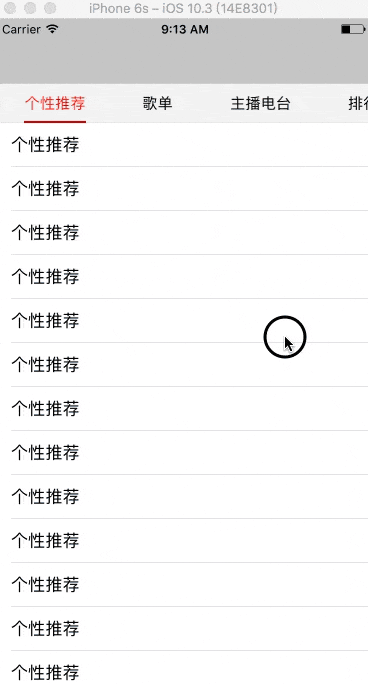

# LJTabPager
自己写的一个开源控件，高仿iOS版网易云音乐页面左右滑动切换效果，如图所示：

［动态图显示不了请点这里］（http://oluwxq3sq.bkt.clouddn.com/LJTabPager.gif）
［静态图显示不了请点这里］（http://oluwxq3sq.bkt.clouddn.com/LJTabPager.PNG）

要使用也很简单，只需要

    LJTabPagerVC *pagerVC = [[LJTabPagerVC alloc] init];

然后给pagerVC提供一个UIViewController的数组即可:

    pagerVC.viewControllers = @[controller1, controller2, controller3, controller4, controller5, controller6, controller7, controller8];

在此之前，必须先给数组里面的viewController的title属性赋值，title即为展示在tabBar上面的文字

    TableViewController *controller1 = [[TableViewController alloc] init];
    controller1.title = @"个性推荐";
    TableViewController *controller2 = [[TableViewController alloc] init];
    controller2.title = @"歌单";
    TableViewController *controller3 = [[TableViewController alloc] init];
    controller3.title = @"主播电台";
    TableViewController *controller4 = [[TableViewController alloc] init];
    controller4.title = @"排行榜";
    TableViewController *controller5 = [[TableViewController alloc] init];
    controller5.title = @"用户";
    TableViewController *controller6 = [[TableViewController alloc] init];
    controller6.title = @"歌手";
    TableViewController *controller7 = [[TableViewController alloc] init];
    controller7.title = @"专辑";
    TableViewController *controller8 = [[TableViewController alloc] init];
    controller8.title = @"单曲";
    
    
 若想使viewController在被选中或滑到了它时收到通知，只需服从`LJTabPagerVCDelegate`协议，然后实现`- (void)hasBeenSelectedAndShown`方法。
