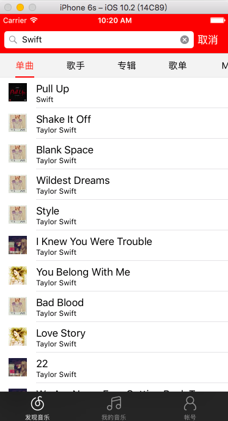

# LJTabPager

\-\-\-\-2017/9/11更新\-\-\-\-\-\-\-\-

在分支`develop-在不同UITableView之间复用Cell`上增加了在LJTabPager管理的视图控制器的tableview间复用cell的功能，我先在项目中试用一下看有没有问题。

\-\-\-\-\-\-\-\-\-\-\-\-\-\-\-\-\-\-\-\-\-

自己写的一个开源控件，高仿iOS版网易云音乐发现音乐和搜索音乐结果页面左右滑动切换效果，如图所示：

[动态图显示不了请点这里](http://oluwxq3sq.bkt.clouddn.com/LJTabPager.gif)

[静态图显示不了请点这里](http://oluwxq3sq.bkt.clouddn.com/IMG_0179.PNG)

要使用也很简单，只需要

    LJTabPagerVC *pagerVC = [[LJTabPagerVC alloc] init];

然后给pagerVC提供一个提供视图控制器的数据源：

    pagerVC.vcsSource = _source;

这个数据源要服从`LJTabPagerVCsSource`协议，这个协议有三个方法：

	- (NSInteger)numberOfViewControllers; /// 要展示的视图控制器数量
	- (NSArray *)titles; /// 要展示的标题数组
	- (UIViewController *)viewControllerAtIndex:(NSInteger)index; /// 在位置index的视图控制器。

主要讲一下`- (UIViewController *)viewControllerAtIndex:(NSInteger)index;`这个代理方法，当滑动到某个位置，该位置的视图控制器不存在时，会向数据源请求获取这个控制器。这样做主要是为了实现懒加载。比如网易新闻有十几个标题，不可能一开始就去创建对应的十几个控制器，只有用户滑到对应的位置才去创建对应的视图控制器，以节省内存。另外，当用户浏览了这十几个控制器，这十几个控制器都在内存中，会占用比较多的内存，这时可以调用LJTabPager的`- (void)reloadVCsExceptSelected:(BOOL)exceptSelected`方法，传入YES参数，把除当前展示的控制器以外的控制器移除，以降低内存占用。当用户再左右滑动时，由于对应的控制器不存在了，所以又去重新向vcsSource数据源获取对应的控制器。
  

例如：

	- (NSInteger)numberOfViewControllers {
	    return 8;
	}
	
	- (NSArray *)titles {
	    NSArray *array = @[@"个性推荐", @"歌单", @"主播电台", @"排行榜", @"用户", @"歌手", @"专辑", @"单曲"];
	    return array;
	}
	
	- (UIViewController *)viewControllerAtIndex:(NSInteger)index {
	    TableViewController *controller = [[TableViewController alloc] init];
	    switch (index) {
	        case 0:
	            controller.title = @"个性推荐";
	            break;
	        case 1:
	            controller.title = @"歌单";
	            break;
	        case 2:
	            controller.title = @"主播电台";
	            break;
	        case 3:
	            controller.title = @"排行榜";
	            break;
	        case 4:
	            controller.title = @"用户";
	            break;
	        case 5:
	            controller.title = @"歌手";
	            break;
	        case 6:
	            controller.title = @"专辑";
	            break;
	        case 7:
	            controller.title = @"单曲";
	            break;
	        default:
	            break;
	    }
	    return controller;
	}

 若想使某个viewController在被选中或滑到了它时收到通知，只需让它服从`LJTabPagerVCDelegate`协议，然后实现`- (void)hasBeenSelectedAndShown`方法。
 
 默认pagerTabBar的背景色是半透明的，你也可以通过`LJTabPagerVC`的 `tabBarBKColor`属性自定义它的背景色。
 
 可以通过`LJTabPagerVC`的`selectedLineColor`属性自定义滚动条的颜色。
 
 可以通过`LJTabPagerVC`的`selectedTabItemColor`属性自定义选中按钮的颜色。
